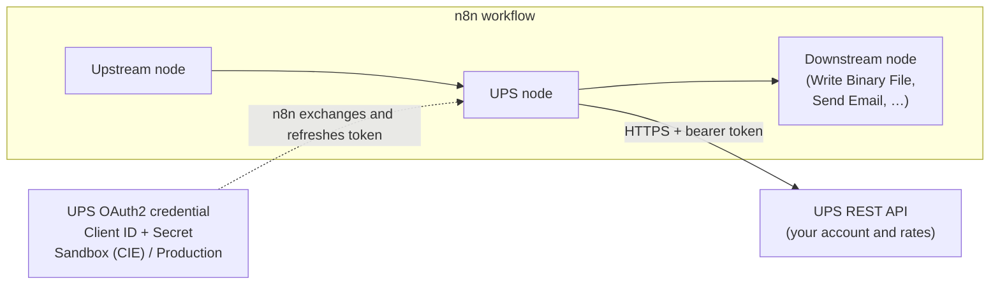
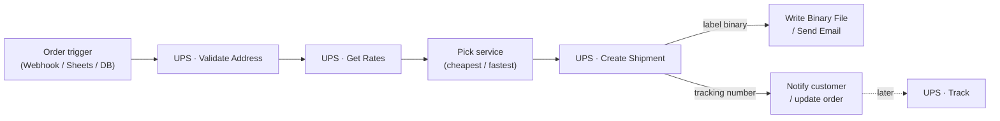
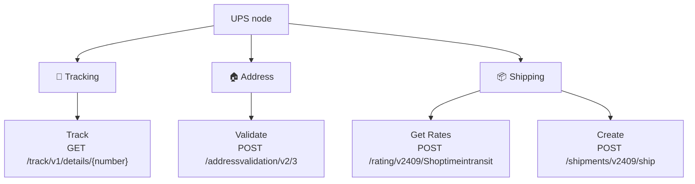
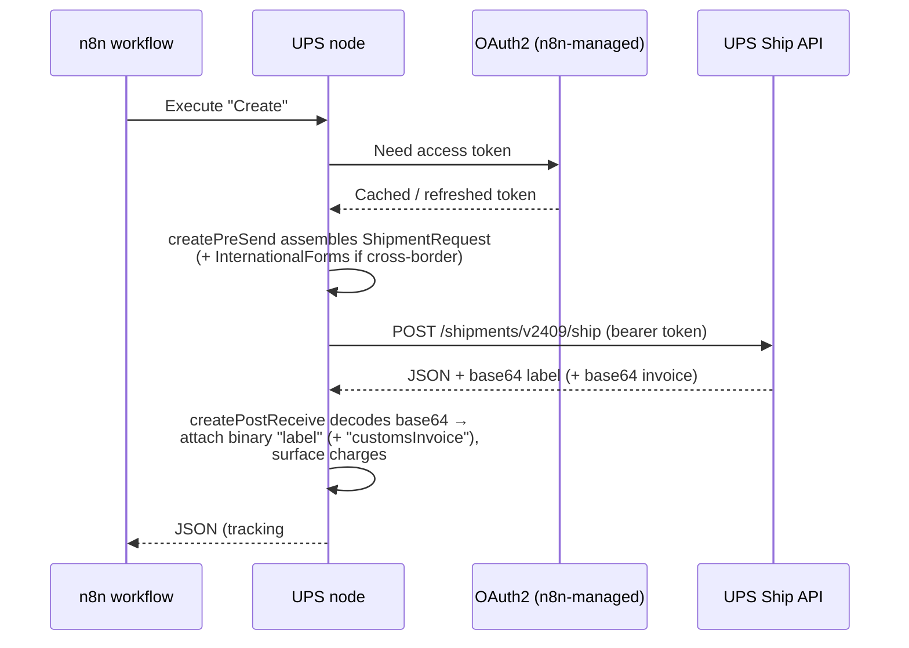

<div align="center">

# 📦 n8n-ups-node

**Use the UPS REST API directly in your n8n workflows.**

Track shipments · validate addresses · quote rates · create labels (with international customs forms) — against _your own_ UPS account, with no aggregator in the middle.

[](https://www.npmjs.com/package/@nodrel-dev/n8n-nodes-ups)
[](https://www.npmjs.com/package/@nodrel-dev/n8n-nodes-ups)
[](https://github.com/nodrel-dev/n8n-ups-node/actions/workflows/ci.yml)
[](https://www.npmjs.com/package/@nodrel-dev/n8n-nodes-ups)
[](https://www.npmjs.com/package/@nodrel-dev/n8n-nodes-ups#provenance)

[Installation](#installation) · [Operations](#operations) · [Credentials](#credentials) · [Shipper Profiles](#shipper-profiles) · [Usage](#usage) · [npm](https://www.npmjs.com/package/@nodrel-dev/n8n-nodes-ups) · [UPS Developer Portal](https://developer.ups.com/) · [Report an issue](https://github.com/nodrel-dev/n8n-ups-node/issues)

</div>

## What is this?

This is an [n8n](https://n8n.io/) community node for the **UPS REST API**. It lets your workflows track shipments, validate addresses, quote rates, and create shipping labels — talking straight to UPS with your own API credentials.

Because there's no aggregator in the middle, you get **your own negotiated rates** and UPS bills your account directly. [n8n](https://n8n.io/) is a [fair-code licensed](https://docs.n8n.io/sustainable-use-license/) workflow automation platform.

### Highlights

- 🚚 **Direct to UPS** — your API keys, your negotiated rates, your account billed. No aggregator markup or middleman.
- 🏷️ **Labels as real binary** — Create returns a print-ready GIF / ZPL / EPL / SPL label as n8n binary data, not a base64 blob buried in JSON.
- 🌍 **International built in** — cross-border Create assembles the UPS commercial-invoice customs forms and returns the UPS-generated invoice as a PDF binary alongside the label.
- 🔑 **One credential, all four APIs** — a single UPS OAuth app entitles Track, Address Validation, Rating, and Ship, so there is exactly one credential to set up.
- 🔀 **One sandbox / production switch** — a single credential field repoints every API request and the OAuth token URL together, so a call can never straddle environments.
- 🔐 **Native OAuth2, no token code** — n8n performs the client-credentials exchange and refreshes the token for you.
- 📦 **Zero runtime dependencies** — ships only `dist/`, published to npm with signed [provenance](https://docs.npmjs.com/generating-provenance-statements).

## Who it's for

- **E-commerce & retail** — print labels at fulfillment, surface tracking to customers, and rate-shop services per order.
- **3PLs & fulfillment ops** — automate shipping for many accounts and wire labels into existing pick-and-pack flows.
- **Cross-border sellers** — generate the commercial invoice and customs forms UPS needs for international shipments, automatically.
- **Finance & operations teams** — quote live negotiated rates inside approval and reconciliation workflows.
- **Developers & integrators** — embed UPS tracking, address validation, rates, and labels into any n8n automation without hand-rolling OAuth.

## How it works

The node sits between your workflow and UPS. A single **UPS OAuth2** credential holds your Client ID/Secret and the sandbox-or-production switch; n8n handles the token exchange, and every request is routed to the matching UPS host.



### A typical workflow

A common fulfillment pipeline wires the four operations together — clean the address, shop for a rate, buy the label, then hand the label binary to wherever it needs to go. Each step is a normal n8n node, so you can branch, filter, or store results at any point.



## Installation

Follow the [installation guide](https://docs.n8n.io/integrations/community-nodes/installation/) in the n8n community nodes documentation. In n8n, go to **Settings → Community Nodes → Install** and enter `@nodrel-dev/n8n-nodes-ups`.

## Operations

The node exposes three resources — **Tracking**, **Address**, and **Shipping** — across four operations:

| Resource | Operation | UPS endpoint | Returns |
| --- | --- | --- | --- |
| 📍 Tracking | **Track** | `GET /track/v1/details/{number}` | Current status + scan history, one inquiry number per item |
| 🏠 Address | **Validate** | `POST /addressvalidation/v2/3` | Standardized `candidates[]`, `resolution`, residential/commercial `classification` |
| 📦 Shipping | **Get Rates** | `POST /rating/v2409/Shoptimeintransit` | One item per eligible service — published + negotiated price, transit days, alerts |
| 📦 Shipping | **Create** | `POST /shipments/v2409/ship` | Tracking number + charges, plus the label as binary (and the customs invoice PDF for international) |



### Tracking → Track

Get the current status and scan history for one UPS inquiry number per item (`GET /track/v1/details/{number}`).

- **Tracking Number** (required) — one inquiry number per input item.
- **Detail** — _Detailed_ (status + scan history) or _Status Only_ (current status only).
- **Locale** — e.g. `en_US`.

Unknown numbers are flagged on their own item; with **Continue On Fail** the rest still process.

### Address → Validate

Standardize an address and classify it residential vs commercial (`POST /addressvalidation/v2/3`).

- Address line(s), city, state/province, postal code, country.
- Returns one item with `resolution` (`valid` / `ambiguous` / `none`), a `classification` (UnClassified / Commercial / Residential), and standardized `candidates[]`.

### Shipping → Get Rates

Quote published and negotiated rates with transit times for every eligible service (`POST /rating/v2409/Shoptimeintransit`).

- **Account Number** (required) — your ShipperNumber; also requests negotiated rates. May instead be supplied by a [Shipper Profile](#shipper-profiles) credential.
- Shipper / Ship To (and optional Ship From) addresses, package weight (+ unit) and optional dimensions (+ unit). The Shipper block can be filled from a [Shipper Profile](#shipper-profiles).
- **Customs Value** — required when origin and destination countries differ (international).
- Emits **one output item per service**, each with published + negotiated price, transit days, and any UPS alerts. If no negotiated rates are returned, a request-level alert is attached to the first item.

### Shipping → Create

Buy a shipment and get a printable label plus tracking number (`POST /shipments/v2409/ship`).

- **Account Number** (required; or supplied by a [Shipper Profile](#shipper-profiles)), **Service** (dropdown of UPS service codes; Ground/`03` default), Shipper / Ship To (and optional Ship From), package weight/dimensions, **Label Format** (GIF default; ZPL / EPL / SPL — no PDF label). The Shipper block can be filled from a [Shipper Profile](#shipper-profiles).
- **International** (origin ≠ destination country) additionally requires the **Customs** fields (a collapsible group: reason for export, currency, terms of shipment, invoice number/date), the **Sold To** party, and at least one **Commodities** line.
- Returns the tracking number and account/published charges, plus the **label** as a binary attachment (`label`); international shipments also return the **commercial invoice** PDF (`customsInvoice`). Label/invoice image data is never embedded as a string in the JSON output.

Billing is to the shipper (transportation charges); international duties are billed to the receiver (DDU) in this version.

## Credentials

You authenticate with a UPS **Client ID** and **Client Secret** using OAuth2 client-credentials. n8n performs the token exchange and refreshes the token automatically — you never handle tokens yourself.

### Prerequisites

1. Create an application on the [UPS Developer Portal](https://developer.ups.com/).
2. Note its **Client ID** and **Client Secret**. A single UPS OAuth app entitles all four APIs used here (Track, Address Validation, Rating, Ship), so one credential covers every operation.
3. For Get Rates and Create you also need your UPS **account number** (ShipperNumber).

### Credential types

The node authenticates with a single credential, **UPS OAuth2 API**, for all four operations. An optional, non-auth **UPS Shipper Profile API** credential can also be attached to supply reusable Shipper data (see [Shipper Profiles](#shipper-profiles)).

| Credential type | Required | Used by |
| --------------- | -------- | ------- |
| `upsOAuth2Api`  | Yes | Track, Validate, Get Rates, Create (authenticates every request) |
| `upsShipperProfileApi` | No | Get Rates, Create (fills the Shipper block; never authenticates) |

### Set up a credential in n8n

1. Add a new **UPS OAuth2 API** credential.
2. Set **Environment** to **Sandbox (CIE)** while developing, or **Production** for real shipments. This single switch points both the OAuth token URL and every API request at the matching UPS host, so a request can never straddle sandbox and production.
3. Enter your **Client ID** and **Client Secret**.
4. Save — n8n runs the credential test (an authenticated Track probe) and shows a green confirmation when the keys are valid. A `401/403` means the Client ID, Secret, or Environment is wrong.

Grant type is OAuth2 **client credentials** (HTTP Basic, empty scope) — configured automatically; nothing to set by hand. Secrets live only in n8n's encrypted credential store; never hardcode them.

> **Sandbox vs production:** credentials default to **Sandbox (CIE)** on purpose, so a half-configured connection can't hit a live account. Switch to **Production** only when you are ready to create real, billable shipments.

### Sandbox vs production hosts

|  | Sandbox (CIE) | Production |
| --- | --- | --- |
| Token URL | `https://wwwcie.ups.com/security/v1/oauth/token` | `https://onlinetools.ups.com/security/v1/oauth/token` |
| API base | `https://wwwcie.ups.com/api` | `https://onlinetools.ups.com/api` |

The Customer Integration Environment (CIE) is limited test data — for example, address validation returns street-level results for **US NY/CA** addresses only, and Track returns a canned `DELIVERED` response for any well-formed `1Z` number.

### Shipper Profiles

Re-entering the same Shipper block on every Get Rates and Create call is the biggest source of form friction — and getting the Shipper country wrong for the account makes UPS reject the call (`111617` Rate / `120120` Ship). An **optional** second credential, **UPS Shipper Profile API**, stores reusable Shipper data so you can swap the whole block (including the account number) by selecting a profile — handy when you ship from more than one registered account (e.g. a Canada-registered and a US account).

- **What it holds:** Account Number (ShipperNumber), Shipper Name, Address (lines, city, state/province, postal, country), and Phone. It carries **no secret** and never authenticates a request — `UPS OAuth2 API` is still the only credential that talks to UPS. Keeping the account number here also keeps it out of the workflow JSON.
- **How to use it:** create a **UPS Shipper Profile API** credential, fill the Shipper fields, then attach it to the UPS node (alongside the OAuth credential). Its **Test** button runs an offline check that the profile is internally usable.
- **Precedence (per field):** an explicit value typed on the node **always wins**; a field left **blank** inherits from the profile; if neither supplies it, the built-in default applies (Shipper country falls back to `US`). So you can use a profile for most fields and still override one in place.
- **Caveat:** profile values fill **at run time**, not in the editor — the fields stay blank in the form and are merged when the workflow executes. (Stock n8n has no way for a community node to write sibling editor fields; see [ADR-0005](docs/adr/0005-optional-shipper-profile-credential.md).)

## Compatibility

- Requires n8n with `n8nNodesApiVersion: 1`.
- Built and tested against the UPS REST API (Track v1, Address Validation v2, Rating v2409, Ship v2409).
- The account number is never defaulted or hardcoded — it comes from the node field or an optional [Shipper Profile](#shipper-profiles) credential, and your API keys live only in the credential.

## Security & dependencies

The published package ships only `dist/` with **zero runtime dependencies** (`n8n-workflow` is a peer, provided by your n8n instance). Any audit findings are confined to the build, test, and release tooling or the host-provided peer — none of them reach an installed node.

Every release is published to npm with a signed **[provenance](https://docs.npmjs.com/generating-provenance-statements) attestation** through GitHub Actions [OIDC trusted publishing](https://docs.npmjs.com/trusted-publishers): no long-lived npm token is stored in the repo, and anyone can cryptographically verify that a given version was built by this workflow from this exact commit (see the **Provenance** panel on the [npm page](https://www.npmjs.com/package/@nodrel-dev/n8n-nodes-ups#provenance)).

The package is also scanned with `npx @n8n/scan-community-package @nodrel-dev/n8n-nodes-ups` as part of the release process.

## AI-Agent tool usage

The node sets `usableAsTool: true`, so every operation is callable from the AI-Agent **tool** path as well as the normal node path. An AI Agent can call any operation directly (for example "track 1Z…", or "rate this shipment"). Test new workflows through both the normal node path and the tool path.

## Usage

### Get Rates and Create

Both operations share the same **Shipper**, **Ship From**, and **Ship To** address fields, so values carry over when you switch between them. Package dimensions (length/width/height) are optional and only sent to UPS when provided. Ship From is optional and defaults to the Shipper address.

### The label binary (Create)

Create returns the label as proper n8n **binary data** on the output property named `label` — not a base64 string buried in JSON. Under the hood, the node requests an inline base64 label, decodes it, and attaches it as binary so downstream nodes can print or save it directly. International shipments additionally return the UPS commercial invoice as a PDF binary on the property `customsInvoice`:



Choose the format with **Label Format**:

| Label Format | MIME type | Typical use |
| --- | --- | --- |
| GIF | `image/gif` | Default; preview / office printers |
| ZPL | `text/plain` | Zebra thermal printers (4×6 stock) |
| EPL | `text/plain` | Eltron thermal printers (4×6 stock) |
| SPL | `text/plain` | SATO thermal printers (4×6 stock) |

The tracking number and charge details are passed through on the main JSON output. Wire the `label` (and `customsInvoice`) binary into **Write Binary File**, **Send Email** (as an attachment), or any node that consumes binary data.

### Errors and Continue On Fail

UPS error codes and messages are surfaced verbatim through n8n's error handling — classified as authentication, input, or transient — and the node honors **Continue On Fail**: failed items emit an `error` entry and the workflow keeps processing the rest. Non-fatal UPS alerts (for example "no negotiated rates returned") are surfaced as warnings without failing the item.

## Documentation

Deeper docs for contributors and integrators live in [`docs/`](docs/):

- [System Overview](docs/system-overview.md) — architecture, auth/environment model, request lifecycle (with diagrams).
- [Integration Specification](docs/integration-spec.md) — endpoints, request/response shapes, enums, and error handling for all four operations.
- [Data Model](docs/data-model.md) — the typed shapes the node assembles, and the node-parameter → UPS-field mapping.
- [Architecture Decision Records](docs/adr/) — why the key design choices were made.
- [n8n Community Node Gotchas](docs/n8n-gotchas.md) — hard-won build/release/verify traps.

## Development

```bash
npm install      # install dev dependencies
npm test         # run the pure-core unit tests (vitest)
npm run lint     # n8n community-node lint (strict)
npm run build    # compile to dist/
npm run dev      # run locally inside n8n (Node.js >= 22.22)
```

Releases are driven by [release-please](https://github.com/googleapis/release-please): merge the auto-generated release PR on `main` and the workflow tags, publishes to npm with provenance, and scans. Never run a release or `npm publish` locally.

## Resources

- [n8n community nodes documentation](https://docs.n8n.io/integrations/#community-nodes)
- [UPS Developer Portal](https://developer.ups.com/)
- [UPS API catalog](https://developer.ups.com/api/reference)

## Version history

See [CHANGELOG.md](CHANGELOG.md) for the full, per-release history (kept current automatically on each release).

## License

[MIT](LICENSE)
