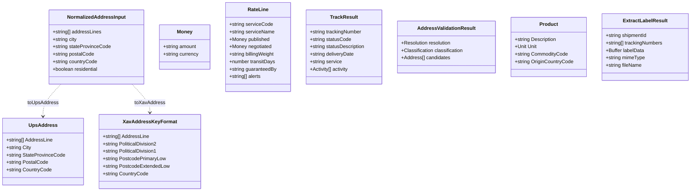
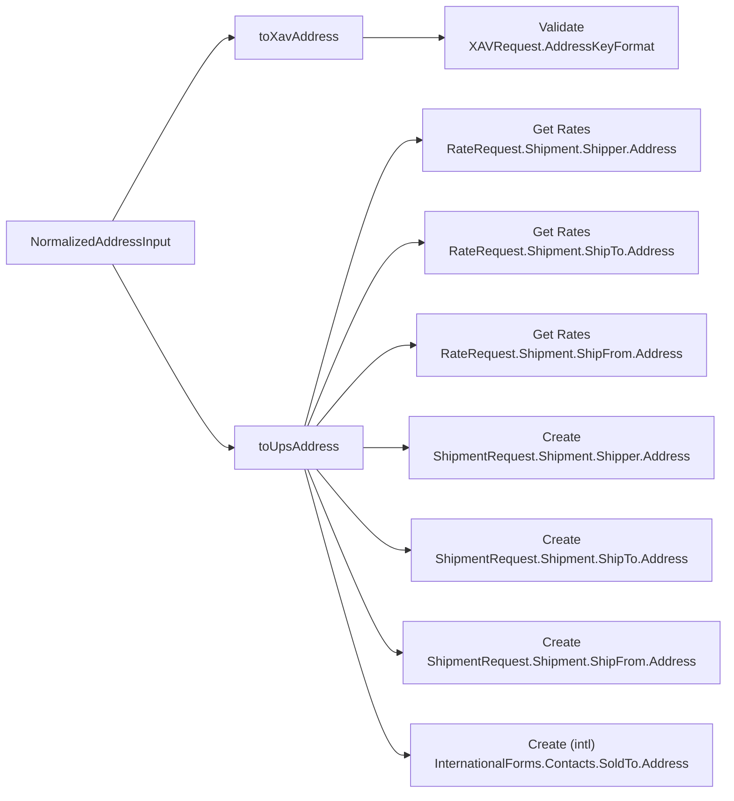

# Data Model — n8n-nodes-ups

> Audience: contributors. These are the typed shapes the pure cores assemble from node parameters
> and the shapes they emit. See [Integration Specification](integration-spec.md) for how each shape
> sits inside a request/response, and the [System Overview](system-overview.md) for the architecture.

The node has no database. "Data model" here means the in-memory shapes that flow from n8n node
parameters → pure cores → UPS request bodies, and from UPS responses → pure cores → n8n output. The
typed shapes live in
[core/types.ts](https://github.com/nodrel-dev/n8n-ups-node/blob/main/nodes/Ups/core/types.ts);
they are deliberately free of any n8n coupling so the cores stay unit-testable (Principle 10).

## Shapes

### Inputs versus UPS shapes

`NormalizedAddressInput` is the loose, flat value read from node parameters; `UpsAddress`
(capitalized `AddressLine` / `City` / `StateProvinceCode` …) and `XavAddressKeyFormat`
(`PoliticalDivision*` / `Postcode*`) are the two cleaned shapes UPS expects in different APIs. The
cores own the rules:

- **`toUpsAddress`** produces the Rate/Ship `Address` shape: `AddressLine[]`, `City`,
  `StateProvinceCode` (omitted when blank), `PostalCode`, `CountryCode`, and a `residential` flag
  only where meaningful (Ship To).
- **`toXavAddress`** produces the Address-Validation shape: city → `PoliticalDivision2`, state →
  `PoliticalDivision1`, and a ZIP+4 split into `PostcodePrimaryLow` / `PostcodeExtendedLow`.

### Output shapes

- **`TrackResult`** (from `mapTrackStatus`) — one per Track item: status fields plus an optional
  `activity[]` of scan events; the activity array is dropped when the user selects `status`.
- **`AddressValidationResult`** (from `shapeCandidates`) — `resolution` (`valid` / `ambiguous` /
  `none`), a `classification` (`{ code, label }`), and standardized `candidates[]`.
- **`RateLine`** (from `flattenRates`) — one flattened row per service: `published` and
  `negotiated` `Money` (negotiated `null` when unentitled), `billingWeight`, `transitDays`,
  `guaranteedBy`, and `alerts[]`.
- **`ExtractLabelResult`** (from `extractLabel`) + **`ExtractedForm[]`** (from `extractForms`) +
  **`ExtractedCharges`** (from `extractCharges`) — the Create response split into the decoded label
  buffer, the customs-invoice PDF buffer(s), and the published/negotiated charges; the base64 image
  data is recursively stripped from the JSON.
- **`Money`** — `{ amount, currency }`, produced by `toMoney` and shared by `flattenRates` and
  Create so the two operations never disagree on how a UPS charge is shaped (`null` when the charge
  is absent).

## Node parameter → UPS field mapping

| Node parameter | UPS field (via core) | Used by |
| -------------- | -------------------- | ------- |
| `{role}AddressLine1` / `{role}AddressLine2` | `Address.AddressLine[]` | Validate, Get Rates, Create |
| `{role}City` | `Address.City` / `PoliticalDivision2` (Validate) | Validate, Get Rates, Create |
| `{role}StateProvinceCode` | `Address.StateProvinceCode` / `PoliticalDivision1` (Validate) | Validate, Get Rates, Create |
| `{role}PostalCode` | `Address.PostalCode` / `PostcodePrimaryLow`+`PostcodeExtendedLow` (Validate, ZIP+4 split) | Validate, Get Rates, Create |
| `{role}CountryCode` | `Address.CountryCode` (default `US`) | Validate, Get Rates, Create |
| `shipToResidential` | `Address.residential` (Ship To only) | Get Rates, Create |
| `shipperName` / `shipToName` / `shipFromName` | `Name` + `AttentionName` | Create |
| `shipperPhone` / `shipToPhone` | `Phone.Number` | Create |
| `accountNumber` | `Shipper.ShipperNumber` (Rate) / `ShipmentCharge.BillShipper.AccountNumber` (Create) — required | Get Rates, Create |
| `weight` / `weightUnit` | `Package.PackageWeight` + `ShipmentTotalWeight` (Rate) | Get Rates, Create |
| `dimensions.dimension` / `dimensionUnit` | `Package.Dimensions` (sent only when provided) | Get Rates, Create |
| `customsValue` / `customsCurrency` | `InvoiceLineTotal.MonetaryValue`/`CurrencyCode` (required if international) | Get Rates |
| `service` | `Service.Code` (options dropdown; default `03`) | Create |
| `labelFormat` | `LabelSpecification.LabelImageFormat.Code` + binary MIME | Create |
| `customs.reasonForExport` / `customs.currency` / `customs.termsOfShipment` | `InternationalForms.ReasonForExport` / `CurrencyCode` / `TermsOfShipment` | Create (international) |
| `customs.invoiceNumber` / `customs.invoiceDate` | `InternationalForms.InvoiceNumber` / `InvoiceDate` (date defaults to today UTC) | Create (international) |
| `soldTo*` | `InternationalForms.Contacts.SoldTo` | Create (international) |
| `commodities.line[]` | `InternationalForms.Product[]` (via `buildCommodities`; ≥1 required if international) | Create (international) |

`{role}` is `shipper`, `shipTo`, `shipFrom`, or `soldTo`; the same builders are reused across Get
Rates and Create so values carry over when switching operation. Ship From defaults to the Shipper
address when left blank.

## The one-Address, many-positions crux

A single `NormalizedAddressInput` is normalized by **two** different cores into structurally
different request positions across four operations. This is the core reason address assembly is a
pure function rather than per-field declarative routing:

The Validate API uses an entirely different field vocabulary (`PoliticalDivision*`, `Postcode*`)
from the Rate/Ship APIs (`City`, `StateProvinceCode`, `PostalCode`), the `residential` flag is a
user **input** for a Ship To but the **output** of Validate, and the same shape must land in shipper,
ship-to, ship-from, and sold-to positions. Two pure cores normalize all of it, and the international
trigger that decides whether the sold-to / customs positions are populated is the runtime
`isInternational` predicate ([ADR-0003](adr/0003-international-trigger-is-runtime-not-displayoptions.md)),
not `displayOptions` visibility.

## Pure cores

| Core | Signature (in → out) | Role |
| ---- | -------------------- | ---- |
| `toUpsAddress` | `NormalizedAddressInput → UpsAddress` | Rate/Ship address shape |
| `toXavAddress` | `NormalizedAddressInput → XavAddressKeyFormat` | Validate address shape |
| `mapTrackStatus` | `TrackResponse, {detail} → TrackResult[]` | Track status + scan history |
| `shapeCandidates` | `XavResponse → AddressValidationResult` | Validate resolution + candidates |
| `flattenRates` | `RateResponse, {wantTransit} → RateLine[]` | One row per service + alerts |
| `buildCommodities` | `CommodityLineInput[] → Product[]` | Customs commodity lines |
| `buildInternationalForms` | `CustomsInput, Product[] → InternationalForms` | Commercial-invoice forms block |
| `extractLabel` | `ShipResponse, format → ExtractLabelResult` | Decode label, strip base64 from JSON |
| `extractForms` | `ShipResponse → ExtractedForm[]` | Decode customs-invoice PDF(s) |
| `extractCharges` | `ShipChargeResponse → ExtractedCharges` | Published + negotiated charges |
| `isInternational` | `InternationalInput → boolean` | Effective-Origin ≠ ShipTo predicate |
| `toMoney` | `UpsCharge \| null → Money \| null` | Shared `{amount, currency}` shaper |
| `mapUpsError` | `INode, body, status → never` | Parse both error envelopes, classify, throw |

## Traceability to repo artifacts

| Shape / logic | Source |
| ------------- | ------ |
| Typed shapes | [core/types.ts](https://github.com/nodrel-dev/n8n-ups-node/blob/main/nodes/Ups/core/types.ts) |
| Address assembly | [core/toUpsAddress.ts](https://github.com/nodrel-dev/n8n-ups-node/blob/main/nodes/Ups/core/toUpsAddress.ts), [core/toXavAddress.ts](https://github.com/nodrel-dev/n8n-ups-node/blob/main/nodes/Ups/core/toXavAddress.ts) |
| Rate shaping | [core/flattenRates.ts](https://github.com/nodrel-dev/n8n-ups-node/blob/main/nodes/Ups/core/flattenRates.ts) |
| Track shaping | [core/mapTrackStatus.ts](https://github.com/nodrel-dev/n8n-ups-node/blob/main/nodes/Ups/core/mapTrackStatus.ts) |
| Address-validation shaping | [core/shapeCandidates.ts](https://github.com/nodrel-dev/n8n-ups-node/blob/main/nodes/Ups/core/shapeCandidates.ts) |
| Customs forms | [core/buildCommodities.ts](https://github.com/nodrel-dev/n8n-ups-node/blob/main/nodes/Ups/core/buildCommodities.ts), [core/buildInternationalForms.ts](https://github.com/nodrel-dev/n8n-ups-node/blob/main/nodes/Ups/core/buildInternationalForms.ts) |
| Label / forms / charges extraction | [core/extractLabel.ts](https://github.com/nodrel-dev/n8n-ups-node/blob/main/nodes/Ups/core/extractLabel.ts), [core/extractForms.ts](https://github.com/nodrel-dev/n8n-ups-node/blob/main/nodes/Ups/core/extractForms.ts), [core/extractCharges.ts](https://github.com/nodrel-dev/n8n-ups-node/blob/main/nodes/Ups/core/extractCharges.ts) |
| Money + international predicate | [core/toMoney.ts](https://github.com/nodrel-dev/n8n-ups-node/blob/main/nodes/Ups/core/toMoney.ts), [core/isInternational.ts](https://github.com/nodrel-dev/n8n-ups-node/blob/main/nodes/Ups/core/isInternational.ts) |
| Request-body builders | [core/buildRateRequest.ts](https://github.com/nodrel-dev/n8n-ups-node/blob/main/nodes/Ups/core/buildRateRequest.ts), [core/buildShipmentRequest.ts](https://github.com/nodrel-dev/n8n-ups-node/blob/main/nodes/Ups/core/buildShipmentRequest.ts), [core/buildShipmentResult.ts](https://github.com/nodrel-dev/n8n-ups-node/blob/main/nodes/Ups/core/buildShipmentResult.ts) |
| Parameter readers + Effective Origin | [resources/shipping/readParties.ts](https://github.com/nodrel-dev/n8n-ups-node/blob/main/nodes/Ups/resources/shipping/readParties.ts) |
| Shipping UI field builders | [resources/shipping/shippingFields.ts](https://github.com/nodrel-dev/n8n-ups-node/blob/main/nodes/Ups/resources/shipping/shippingFields.ts) |
| Shipper Profile precedence (ADR-0005) | [resources/shipping/shipperProfile.ts](https://github.com/nodrel-dev/n8n-ups-node/blob/main/nodes/Ups/resources/shipping/shipperProfile.ts) |
