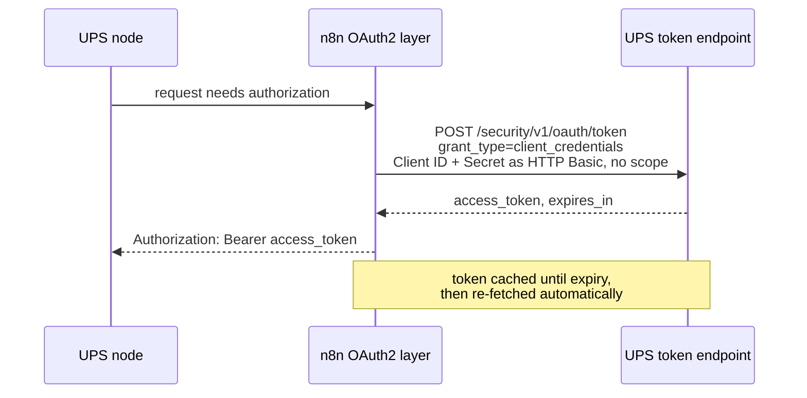

# Integration Specification — n8n-nodes-ups

> Audience: contributors and integrators who need the exact endpoints, request/response shapes, and
> transforms. For the bigger picture, see the [System Overview](system-overview.md); for typed
> shapes, see the [Data Model](data-model.md).

All requests share `requestDefaults`: `Accept: application/json`, `Content-Type: application/json`,
and a `baseURL` that follows the credential's Environment field —
`https://wwwcie.ups.com/api` (sandbox / CIE) or `https://onlinetools.ups.com/api` (production). The
API base URL includes the `/api` segment; the OAuth token endpoint does not.

## Authentication

The credential extends n8n's built-in `oAuth2Api` with `grantType: clientCredentials`. n8n runs the
token exchange and refreshes the token; the node never handles tokens directly.



Key facts:

- **`client_id` / `client_secret`** map to the UPS **Client ID** / **Client Secret**, sent as HTTP
  **Basic** in the `Authorization` header.
- **No scope.** UPS's `client_credentials` flow uses an empty scope; the credential sends none.
- **Token URL follows Environment**: `https://wwwcie.ups.com/security/v1/oauth/token` (sandbox) or
  `https://onlinetools.ups.com/security/v1/oauth/token` (production) — driven by
  `$self["environment"]`.
- **One credential, all four APIs.** A single UPS OAuth app entitles Track, Address Validation,
  Rating, and Ship, so every operation binds the same `upsOAuth2Api` credential.

### Credential test

| | |
| --- | --- |
| Method + URL | `GET /api/track/v1/details/1Z00000000000000000` (against the env-derived base host) |
| Headers | `transId: n8n-nodes-ups-credtest`, `transactionSrc: n8n-nodes-ups` |
| Pass | Reaching UPS's Track layer (HTTP 200; CIE returns a canned response for any well-formed `1Z`) |
| Fail | `401` / `403` → wrong Client ID, Secret, or Environment |

See [ADR-0002](adr/0002-credential-test-track-notfound-is-pass.md) for why a Track "not found"
counts as a pass.

## Operations

All four operations set `ignoreHttpStatusErrors: true` so `postReceive` runs on non-2xx responses
and `mapUpsError` can surface UPS's code/message (see [Error handling](#error-handling)).

### Track

| | |
| --- | --- |
| Resource / Operation | Tracking / `track` |
| Method + URL | `GET /track/v1/details/{trackingNumber}` |
| Credential | `upsOAuth2Api` |
| Transform | response → `trackPostReceive` → `mapTrackStatus` |

**Required headers** (UPS Track v1 400s without both — `TV0011` / `TV0001`; no other UPS API
requires them):

| Header | Value |
| ------ | ----- |
| `transactionSrc` | `n8n-nodes-ups` (static client identifier) |
| `transId` | `n8n-<epoch-millis>` (per-request unique id, ≤32 chars) |

**Inputs**

| Field | Type | Notes |
| ----- | ---- | ----- |
| Tracking Number | string | Required; one UPS inquiry number per item |
| Detail | options | `detailed` (default; status + activity) or `status` (status only) |
| Locale | string | e.g. `en_US`; sent as a query parameter |

**Output:** one item per input, shaped by `mapTrackStatus` — `trackingNumber`, `statusType`,
`statusCode`, `statusDescription`, `deliveryDate`, `service`, and (when `detail = detailed`) an
`activity[]` scan history. `status` suppresses the activity array client-side.

### Validate

| | |
| --- | --- |
| Resource / Operation | Address / `validate` |
| Method + URL | `POST /addressvalidation/v2/3` |
| Credential | `upsOAuth2Api` |
| Transform | `validatePreSend` → `toXavAddress` (request); `validatePostReceive` → `shapeCandidates` (response) |

The trailing `3` in the URL is the UPS **request option** (validation **and** classification). In
CIE, street-level validation is limited to **US NY/CA** addresses.

**Inputs:** Address Line 1 (required), Address Line 2, City, State/Province Code, Postal Code
(ZIP+4 like `14201-1234` is split into primary/extended), Country Code (default `US`).

**Request body**

```json
{
  "XAVRequest": {
    "AddressKeyFormat": {
      "AddressLine": ["123 Main St"],
      "PoliticalDivision2": "Buffalo",
      "PoliticalDivision1": "NY",
      "PostcodePrimaryLow": "14201",
      "PostcodeExtendedLow": "1234",
      "CountryCode": "US"
    }
  }
}
```

`PoliticalDivision2` is the city, `PoliticalDivision1` is the state/province. The body is assembled
by the `toXavAddress` core.

**Output (after `shapeCandidates`):** one item —

```json
{
  "resolution": "valid",
  "classification": { "code": "1", "label": "Commercial" },
  "candidates": [
    { "addressLines": ["123 MAIN ST"], "city": "BUFFALO", "stateProvinceCode": "NY",
      "postalCode": "14201-1234", "countryCode": "US", "residential": false }
  ]
}
```

`resolution` is `valid` / `ambiguous` / `none`; `classification.code` is `0` UnClassified, `1`
Commercial, `2` Residential.

### Get Rates

| | |
| --- | --- |
| Resource / Operation | Shipping / `getRates` |
| Method + URL | `POST /rating/v2409/Shoptimeintransit` |
| Credential | `upsOAuth2Api` |
| Transform | `ratesPreSend` → `toUpsAddress` (request); `ratesPostReceive` → `flattenRates` (response) |

`Shoptimeintransit` is the request option that returns the service list **with** transit times. It
requires two containers that plain `Shop`/`Rate` do not: `DeliveryTimeInformation.PackageBillType`
(`03` = non-document) and `ShipmentTotalWeight` (with a `Description` on the unit). Omitting them
returns `111563` / the misleading `111546` "Invalid Weight" — see
[gotchas §12](n8n-gotchas.md).

**Inputs:** Account Number (required — your ShipperNumber; presence of the negotiated-rates
indicator also requests negotiated pricing), Shipper + Ship To addresses (Ship To has an optional
`residential` flag), optional Ship From (defaults to Shipper), package weight + unit (`LBS`/`KGS`),
optional dimensions + unit (`IN`/`CM`), and Customs Value + currency (required when international).

**Request body (abridged)**

```json
{
  "RateRequest": {
    "PickupType": { "Code": "01" },
    "Shipment": {
      "Shipper": { "ShipperNumber": "<account>", "Address": { "…": "…" } },
      "ShipTo": { "Address": { "…": "…" } },
      "ShipFrom": { "Address": { "…": "…" } },
      "DeliveryTimeInformation": { "PackageBillType": "03" },
      "ShipmentTotalWeight": {
        "UnitOfMeasurement": { "Code": "LBS", "Description": "LBS" }, "Weight": "1"
      },
      "ShipmentRatingOptions": { "NegotiatedRatesIndicator": "" },
      "Package": {
        "PackagingType": { "Code": "02" },
        "PackageWeight": { "UnitOfMeasurement": { "Code": "LBS" }, "Weight": "1" }
      }
    }
  }
}
```

When the shipment is international, an `InvoiceLineTotal` (`CurrencyCode` + `MonetaryValue` from the
customs value) is added to the `Shipment`. `PickupType.Code` defaults to `01` and `PackagingType.Code`
to `02`.

**Output (after `flattenRates`)** — one item **per service**:

```json
{
  "serviceCode": "03",
  "serviceName": "Ground",
  "published": { "amount": "67.89", "currency": "USD" },
  "negotiated": { "amount": "45.67", "currency": "USD" },
  "billingWeight": "1.0",
  "transitDays": 5,
  "guaranteedBy": "20260624",
  "alerts": []
}
```

`negotiated` is `null` when the account is not entitled to negotiated rates on that lane; when
**all** services come back without negotiated rates, a request-level alert
("No negotiated rates were returned…") is attached to the first item. `transitDays` / `guaranteedBy`
come from the time-in-transit data. Per-service and request-level UPS alerts are surfaced in
`alerts[]`.

### Create

| | |
| --- | --- |
| Resource / Operation | Shipping / `create` |
| Method + URL | `POST /shipments/v2409/ship` |
| Credential | `upsOAuth2Api` |
| Transform | `createPreSend` → `toUpsAddress` / `buildCommodities` / `buildInternationalForms` (request); `createPostReceive` → `extractLabel` / `extractForms` / `extractCharges` (response) |

`Request.RequestOption` is hardcoded `nonvalidate` (address validation is a separate operation) and
not exposed.

**Inputs:** Account Number (required), Service Code (default `03`), Shipper (address + name +
phone), optional Ship From (address + name, defaults to Shipper), Ship To (address + name + phone +
optional `residential`), package weight/dimensions + units, Label Format (`GIF` default; `ZPL` /
`EPL` / `SPL`). **International** (origin ≠ destination country) additionally requires: Reason for
Export (default `SALE`), Currency (default `USD`), Terms of Shipment (default `DDU`), optional
Invoice Number/Date (date defaults to today UTC), Sold-To party (name + address), and at least one
commodity line.

**Request body — domestic (abridged)**

```json
{
  "ShipmentRequest": {
    "Request": { "RequestOption": "nonvalidate" },
    "Shipment": {
      "Description": "Shipment",
      "Shipper": {
        "Name": "Acme Corp", "AttentionName": "Acme Corp",
        "ShipperNumber": "<account>", "Phone": { "Number": "5551234567" },
        "Address": { "…": "…" }
      },
      "ShipTo": { "Name": "Customer", "Phone": { "Number": "5559999999" }, "Address": { "…": "…" } },
      "ShipFrom": { "Name": "Acme Corp", "Address": { "…": "…" } },
      "PaymentInformation": {
        "ShipmentCharge": { "Type": "01", "BillShipper": { "AccountNumber": "<account>" } }
      },
      "ShipmentRatingOptions": { "NegotiatedRatesIndicator": "" },
      "Service": { "Code": "03" },
      "Package": {
        "Packaging": { "Code": "02" },
        "PackageWeight": { "UnitOfMeasurement": { "Code": "LBS" }, "Weight": "1" }
      }
    },
    "LabelSpecification": { "LabelImageFormat": { "Code": "GIF" } }
  }
}
```

Note the request-side container difference from Get Rates: Ship uses `Package.Packaging`, Rate uses
`Package.PackagingType`. Billing is always `PaymentInformation.ShipmentCharge` **Type `01`
BillShipper** in v1 (transportation charges to the shipper). For thermal formats (`ZPL`/`EPL`/`SPL`)
a `LabelStockSize` of 4×6 (`Height: "6", Width: "4"`) is added; `GIF` needs none.

**International** adds a `ShipmentServiceOptions.InternationalForms` block to the `Shipment`:

```json
{
  "ShipmentServiceOptions": {
    "InternationalForms": {
      "FormType": ["01"],
      "ReasonForExport": "SALE",
      "CurrencyCode": "USD",
      "InvoiceNumber": "INV-12345",
      "InvoiceDate": "20260619",
      "TermsOfShipment": "DDU",
      "Contacts": { "SoldTo": { "Name": "Buyer Ltd", "Address": { "…": "…" } } },
      "Product": [
        { "Description": "Widget",
          "Unit": { "Number": "10", "UnitOfMeasurement": { "Code": "EA" }, "Value": "25.00" },
          "CommodityCode": "123456789", "OriginCountryCode": "US" }
      ]
    }
  }
}
```

`FormType ["01"]` is the commercial Invoice (the only form type in v1). `buildCommodities` maps each
commodity row to a `Product[]` entry; `buildInternationalForms` assembles the block; the
international trigger is the runtime `isInternational` predicate, **not** field visibility (see
[ADR-0003](adr/0003-international-trigger-is-runtime-not-displayoptions.md)).

**Output (after `extractLabel` / `extractForms` / `extractCharges`)**

- `json`: `shipmentId`, `trackingNumbers[]`, `international` flag, and `charges`
  (`published` + `negotiated`, each `{ amount, currency }` or `null`). Base64 image data is
  recursively stripped so the JSON never carries the blob.
- `binary.label`: the decoded label, named `<trackingNumber>.<format>` (MIME `image/gif` for GIF,
  `text/plain` for ZPL/EPL/SPL).
- `binary.customsInvoice`: the UPS commercial-invoice **PDF** (`application/pdf`), international
  shipments only, named `customs-invoice-<shipmentId>.pdf`.

## Enums and codes

| Concept | Values |
| ------- | ------ |
| Track **Detail** | `detailed` (default), `status` |
| **Label Format** (Create) | `GIF` (default, `image/gif`), `ZPL`, `EPL`, `SPL` (all `text/plain`, 4×6 stock) |
| **Weight unit** | `LBS` (default), `KGS` |
| **Dimension unit** | `IN` (default), `CM` |
| **Service Code** (Create) | UPS `Service.Code` string, default `03` (Ground). Common: `01` Next Day Air, `02` 2nd Day Air, `03` Ground, `11` UPS Standard. Use the value valid for the shipment's lane. |
| **Validate resolution** | `valid`, `ambiguous`, `none` |
| **Validate classification** | `0` UnClassified, `1` Commercial, `2` Residential |
| **Terms of Shipment** (international) | `DDU` only in v1 (duties billed to receiver) |
| Hardcoded codes | PickupType `01`, PackagingType/Packaging `02`, PackageBillType `03`, ShipmentCharge Type `01` (BillShipper), Create RequestOption `nonvalidate`, Validate request option `3`, FormType `["01"]` |

## Error handling

- **`ignoreHttpStatusErrors: true` + `mapUpsError`.** On any non-2xx, the postReceive calls
  `mapUpsError(node, body, statusCode)`, which parses **both** UPS envelope shapes — the common
  `response.errors[]` and Track's distinct `Response.response.errors[]` — plus a defensive
  `errors[]` fallback, and throws a `NodeApiError` carrying the UPS `code` and `message` verbatim.
- **Classification by status:** `401/403` → authentication (`UPS authentication failed …`);
  `429` and `5xx` → transient (`UPS is temporarily unavailable — try again …`, surfaced at warning
  level); other `4xx` → input (`UPS rejected the request (invalid input) …`). This mirrors the
  treat-4xx-as-input/auth, 5xx/429-as-transient rule; transient resilience is left to n8n's native
  **Retry On Fail** ([ADR-0001](adr/0001-native-retry-over-backoff.md)).
- **Boundary validations** throw before the request: non-empty account number (Get Rates, Create);
  customs value when international (Get Rates); at least one commodity line when international
  (Create); a present label in the response (Create).
- **Continue On Fail.** All operations honor n8n's Continue On Fail — a failing item produces a JSON
  error entry instead of aborting the whole execution. Non-fatal UPS alerts are surfaced as warnings
  without failing the item.

## Traceability to repo artifacts

| Operation / concern | Source |
| ------------------- | ------ |
| Track | [resources/tracking/track.operation.ts](https://github.com/nodrel-dev/n8n-ups-node/blob/main/nodes/Ups/resources/tracking/track.operation.ts) |
| Validate | [resources/address/validate.operation.ts](https://github.com/nodrel-dev/n8n-ups-node/blob/main/nodes/Ups/resources/address/validate.operation.ts) |
| Get Rates | [resources/shipping/getRates.operation.ts](https://github.com/nodrel-dev/n8n-ups-node/blob/main/nodes/Ups/resources/shipping/getRates.operation.ts) |
| Create | [resources/shipping/create.operation.ts](https://github.com/nodrel-dev/n8n-ups-node/blob/main/nodes/Ups/resources/shipping/create.operation.ts) |
| Shared shipping field builders / readers | [resources/shipping/shared.ts](https://github.com/nodrel-dev/n8n-ups-node/blob/main/nodes/Ups/resources/shipping/shared.ts) |
| Credential + test | [UpsOAuth2Api.credentials.ts](https://github.com/nodrel-dev/n8n-ups-node/blob/main/credentials/UpsOAuth2Api.credentials.ts) |
| Error mapping | [core/mapUpsError.ts](https://github.com/nodrel-dev/n8n-ups-node/blob/main/nodes/Ups/core/mapUpsError.ts) |
| Live CIE traps | [docs/n8n-gotchas.md](n8n-gotchas.md) |
