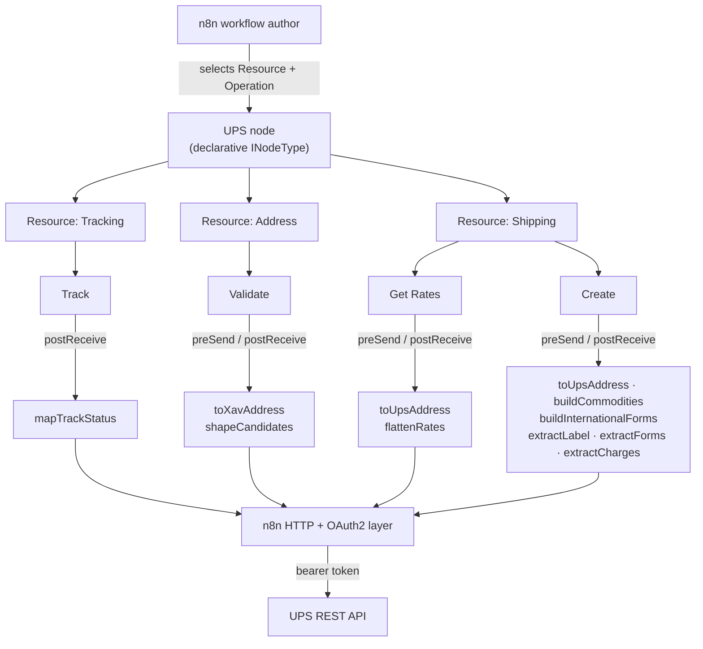
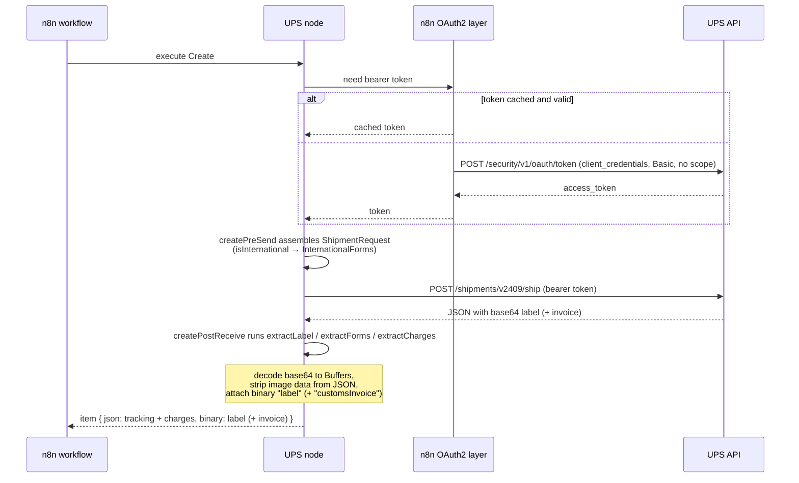

# System Overview — n8n-nodes-ups

> Audience: contributors and integrators. For installation and usage, see the
> [README](../README.md). For the per-operation request/response reference, see
> [Integration Specification](integration-spec.md). For the typed shapes, see
> [Data Model](data-model.md).

## Business purpose

`n8n-nodes-ups` is an [n8n](https://n8n.io/) community node that calls the **UPS REST API
directly** — no shipping aggregator in between. A business uses its **own** UPS API credentials
and account number, so workflows quote the account's **negotiated rates**, and UPS bills that
account directly. The node packages four UPS capabilities as n8n operations: track a shipment,
validate an address, quote rates, and create a shipment with a printable label (and, for
cross-border shipments, the customs commercial invoice).

The differentiator versus a generic HTTP Request node is that the messy parts are handled: native
OAuth2 token exchange, a single sandbox/production switch that moves the token URL and every API
call together, the UPS-required `transId`/`transactionSrc` Track headers and the extra rating
containers UPS demands for transit times, international customs-form assembly, and a shipping label
returned as real n8n **binary** data (a print-ready GIF/ZPL/EPL/SPL file) instead of a base64 string
buried in JSON.

## Scope

In scope:

- Four operations across three resources (see below).
- OAuth2 `client_credentials` authentication via n8n's built-in credential layer.
- Sandbox (CIE) and production environments behind one credential field.
- Request assembly and response reshaping for the four operations.
- International (cross-border) Rate and Ship, including commercial-invoice customs forms and the
  UPS-generated invoice returned as PDF binary.

Out of scope (v1):

- UPS capabilities beyond the four operations (pickup scheduling, void/cancel, label recovery,
  Landed Cost duty estimation, locations, etc.).
- Webhooks/push tracking — the node is request/response only.
- Multi-package shipments — one package per shipment.
- International form types beyond the commercial Invoice, and DDP (duty-paid) billing — v1 is DDU
  (duties billed to the receiver).
- Storing or rotating credentials — that is n8n's responsibility.

## Functional behavior

The node is a single declarative n8n node (`displayName: "UPS"`, internal name `ups`). The user
picks a **Resource**, then an **Operation**; n8n shows the fields for that operation and, on
execute, routes the request to the matching UPS endpoint. The node is also exposed as an AI agent
tool (`usableAsTool: true`).

UPS issues **one OAuth application that entitles all four APIs** (Track, Address Validation, Rating,
Ship), so unlike a multi-project setup there is exactly **one credential type**. Every operation
binds the same `upsOAuth2Api` credential:

| Resource     | Operations         | Credential      | UPS API |
| ------------ | ------------------ | --------------- | ------- |
| **Tracking** | Track              | `upsOAuth2Api`  | Track v1 |
| **Address**  | Validate           | `upsOAuth2Api`  | Address Validation v2 |
| **Shipping** | Get Rates, Create  | `upsOAuth2Api`  | Rating v2409, Ship v2409 |

### Architecture

The node stays **declarative**: each operation declares its HTTP method and URL, and the
request/response work that routing cannot express is done in small, pure functions ("cores") behind
thin `preSend`/`postReceive` adapters (see
[ADR-0004](adr/0004-error-mapping-via-postreceive-not-default.md)). The cores know nothing about
n8n, so they are unit-tested in isolation. The node has **no `execute()` method** — defining one
would disable declarative routing for every operation — so even Create's customs assembly and
label/invoice binary extraction live in its declarative `preSend`/`postReceive` hooks.

All four operations set `ignoreHttpStatusErrors: true` so that `postReceive` runs on non-2xx
responses and the shared `mapUpsError` core can surface UPS's own error code and message verbatim
rather than n8n's generic failure (see [ADR-0004](adr/0004-error-mapping-via-postreceive-not-default.md)).

### Authentication and environment model

The credential `extends` n8n's built-in `oAuth2Api` with `grantType: clientCredentials`, so n8n
performs the token exchange and caches/refreshes the token natively — there is no hand-rolled token
code. Two UPS-specific rules are encoded:

- **Empty scope, HTTP Basic.** UPS's `client_credentials` flow uses HTTP Basic (Client ID / Secret
  in the `Authorization` header) and an **empty** scope; the credential sends no scope.
- **One environment switch.** A single `Environment` dropdown (`sandbox` default, or `production`)
  drives both the OAuth `accessTokenUrl` (`$self["environment"]`) and the node's
  `requestDefaults.baseURL` (`$credentials.environment`), so token exchange and API calls can never
  target different hosts (see
  [ADR-0001](adr/0001-native-retry-over-backoff.md) for the wider resilience model and the
  constitution for the host-split guard). The token endpoint host has **no** `/api` segment; the
  API base URL **does** (`…/api`). Defaulting to sandbox keeps a half-configured connection — or an
  unattended AI agent — off a live account.

The credential `test` is an **authenticated Track probe** — `GET /api/track/v1/details/1Z00000000000000000`
against the environment-derived base URL, with the two required Track headers — rather than the bare
token grant. Reaching UPS's Track business layer (CIE returns a canned response for any well-formed
`1Z` number) confirms the credentials and environment; a `401/403` fails the test
(see [ADR-0002](adr/0002-credential-test-track-notfound-is-pass.md)).

### Request lifecycle

Create is the richest path: its `preSend` assembles the shipment body (adding the
`InternationalForms` block when the shipment is cross-border), and its `postReceive` decodes the
base64 label and any customs-invoice PDF into binary and surfaces the charges (see
[ADR-0003](adr/0003-international-trigger-is-runtime-not-displayoptions.md) for the international
trigger).

## Data inputs and outputs

| Operation | Key inputs | Output |
| --------- | ---------- | ------ |
| Track     | One inquiry number; detail toggle; locale | One item: status + optional scan history |
| Validate  | An address | One item: resolution + classification + standardized candidates |
| Get Rates | Account number, shipper + ship-to (+ optional ship-from) address, package, optional customs value | One JSON row **per service**: published + negotiated rate, transit days, alerts |
| Create    | Account number, service code, addresses, package, label format (+ customs fields if international) | One item: tracking number + charges, plus a binary label (+ customs invoice PDF) |

Field-by-field shapes are in the [Data Model](data-model.md). Endpoint and body details are in the
[Integration Specification](integration-spec.md).

## Dependencies

- **n8n** runtime (`n8n-workflow` peer types; the OAuth2 and binary helpers).
- **UPS REST API** — `wwwcie.ups.com` (sandbox / CIE) and `onlinetools.ups.com` (production).
- **Zero runtime npm dependencies.** The package ships only `dist/`. `vitest` is a dev-only
  dependency for the core unit tests.

## Risks and failure modes

- **Missing Track headers.** UPS Track v1 returns HTTP 400 (`TV0011` / `TV0001`) without both
  `transactionSrc` and `transId`. The node sets both on every Track call and on the credential test;
  omitting them silently breaks Track **and** the Test button.
- **Rating transit-time containers.** `Shoptimeintransit` 400s (`111563`, and the misleading
  `111546` "Invalid Weight") unless the request carries both `DeliveryTimeInformation` and
  `ShipmentTotalWeight`. The node always sends them.
- **Account country must match the shipper.** Create enforces that the account's registered country
  equals the Shipper country, returning `120120` otherwise — and a clean rate quote does **not**
  guarantee Create will accept the same Shipper (Rating is lenient, Ship is strict).
- **Missing account number.** Get Rates and Create fail fast with a clear error if the account
  number is blank.
- **International requirements.** When origin and destination countries differ, Get Rates requires a
  customs value and Create requires at least one commodity line; both throw a descriptive error
  before the request if those are missing.
- **No label / no negotiated rates.** If UPS returns no label, extraction throws rather than
  emitting an empty file. If no negotiated rates are returned, a non-fatal alert is attached rather
  than failing the item — this is usually an account-entitlement fact, not a node bug.

## Monitoring and support implications

- The node honors n8n's **Continue On Fail**: when enabled, a failing item yields a JSON error entry
  instead of aborting the whole execution.
- UPS errors are surfaced from both UPS error-envelope shapes (the common `response.errors[]` and
  Track's distinct schema) via `mapUpsError`, classified as auth / input / transient, so the
  operator sees the real UPS code and reason, not a generic failure.
- There is no server to operate — the node runs inside the user's n8n instance. "Support" is mostly
  credential setup (one app, one credential) and confirming account entitlement (negotiated rates,
  registered country) against UPS.

## Assumptions and unknowns

- **Assumption:** the four UPS endpoints and their field names remain stable at the documented
  versions (Track v1, Address Validation v2, Rating/Ship v2409). They were verified against the
  captured specs and live CIE round-trips on 2026-06-18/19.
- **Assumption:** one UPS OAuth application entitles all four APIs (verified live in CIE).
- **Unknown:** production-account behavior for negotiated rates and the registered-country check
  varies per account/lane; CIE confirmed the mechanism but not every account's entitlement.

## Open questions

- Should additional UPS services (pickup scheduling, void/cancel, Landed Cost) become future
  operations or a separate node?
- Should multi-package shipments and DDP billing be added in a later version?

## Traceability to repo artifacts

| Concern | Source |
| ------- | ------ |
| Node definition, resources, base URL, credential binding | [Ups.node.ts](https://github.com/nodrel-dev/n8n-nodes-ups/blob/main/nodes/Ups/Ups.node.ts) |
| OAuth config, environment switch, credential test | [UpsOAuth2Api.credentials.ts](https://github.com/nodrel-dev/n8n-nodes-ups/blob/main/credentials/UpsOAuth2Api.credentials.ts) |
| Track operation (headers, postReceive) | [resources/tracking/track.operation.ts](https://github.com/nodrel-dev/n8n-nodes-ups/blob/main/nodes/Ups/resources/tracking/track.operation.ts) |
| Validate operation | [resources/address/validate.operation.ts](https://github.com/nodrel-dev/n8n-nodes-ups/blob/main/nodes/Ups/resources/address/validate.operation.ts) |
| Get Rates operation | [resources/shipping/getRates.operation.ts](https://github.com/nodrel-dev/n8n-nodes-ups/blob/main/nodes/Ups/resources/shipping/getRates.operation.ts) |
| Create operation | [resources/shipping/create.operation.ts](https://github.com/nodrel-dev/n8n-nodes-ups/blob/main/nodes/Ups/resources/shipping/create.operation.ts) |
| Pure cores | [nodes/Ups/core/](https://github.com/nodrel-dev/n8n-nodes-ups/blob/main/nodes/Ups/core) |
| Error mapping | [core/mapUpsError.ts](https://github.com/nodrel-dev/n8n-nodes-ups/blob/main/nodes/Ups/core/mapUpsError.ts) |
| Architecture decisions | [docs/adr/](https://github.com/nodrel-dev/n8n-nodes-ups/blob/main/docs/adr) |
